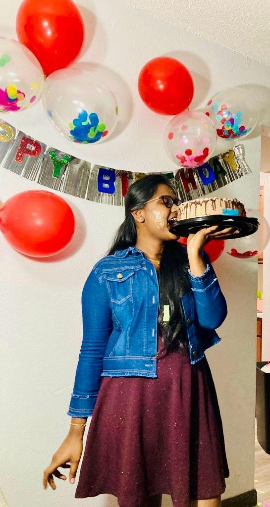

# Sreeja Vasa
I am an avid learner with a deep passion for antiques, archaeology, and the mysteries of the universe. Alongside my love for these subjects, I have a strong affinity for music and consider myself a skilled singer. My ultimate goal is to become self-reliant and make my parents proud through my achievements in life.

--------------------------------------------------------------------------------------------------------------------

# Sports Table

|**Sport name**| **reason for playing**                                   | **hours of playing**|
|:-------------|:-------------------------------------------------------: |--------------------:|
| Basketball   | promotes speed, strength.                                | 30 Minutes          |
| tennis       | Tennis is a good for health, fitness.                    | 1 hour              |
| Hiking       | Hiking reduce your risk of heart disease and stroke.     | 2 hour              |
| Swimming     | Swimming is a great stress reducer.                      | 45 minutes          |